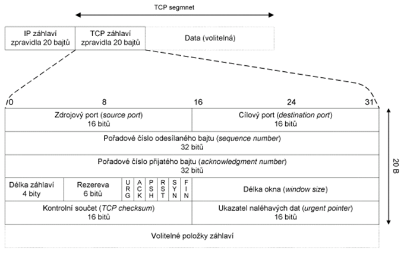
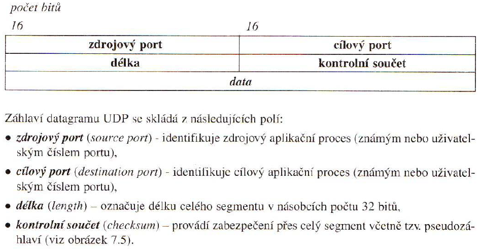
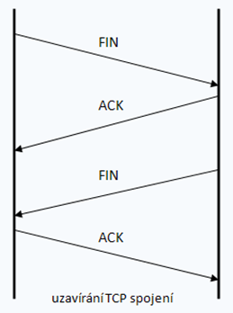
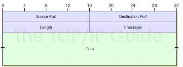

# Otázka 8

# Protokoly UDP a TCP

- protokoly UDP a TCP jsou na 4. (transportní vrstvě) jak ISO/OSI referenčního modelu, tak i TCP/IP modelu
- má na starosti spolehlivost, zajišťuje přenos dat mezi dvěma koncovými účastníky, segmentaci dat, opravy chyb

**služby transportní vrstvy**
- Segmentace – dělení aplikačních dat na menší díly na straně odesílatele
- Multiplexing – umožňuje používat více aplikací komunikujících po sítí v jednom časovém okamžiku
- Navázání spojení
- Spolehlivý provoz
- Opětovné poslání ztracených dat
- Zachování pořadí segmentů při skládání
- Kontrola toku

zajišťuje také, že na základě portu dokáže nasměrovat data správné aplikaci
	- port = 16 bit číslo <=> 0 - 65535 
	- Veřejné porty 1 – 1023
    - Registrované 1024 – 49151
    - Dynamické 49152 – 65535

**TCP**
- Spojový
- Zajistí doručení datových segmentů ve stejném pořadí
- Full-duplex
- Komunikační kanál
- Pojem TCP spojení – dvojice komunikujících portů
- FTP, TELNET, http, SMTP
- Komunikace probíhá ve fázích – vytvoření spojení, řízený přenos proudu dat, ukončení spojení

-  zdrojový port – zdrojový aplikační proces
-  cílový port – cílový aplikační proces
-  pořadové číslo - pořadí
-  číslo potvrzení – následující
-  délka záhlaví
-  funkce řízení – URG, AKC, PSH, RST, SYN, FIN
	- URG -  označuje urgentní data pro přednostní doručení v rámci daného spojení
	- ACK – označuje platnost pole s číslem potvrzení
	- PSH – požaduje okamžité doručení segmentu protokolu vyšší vrstvy
	- RST – požaduje okamžité ukončení spojení
	- SYN – žádost o navázání spojení
	- FIN – žádost o ukončení spojení
- Délka okna – metoda WINDOW – příjemce pošle odesílateli jak má volný buffery a podle toho odesílatel odešle data
- Kontrolní součet – zabezpečení přeš celý segment
- Ukazatel naléhavých dat – specifikuje poslední oktet urgentních dat
- Volitelné položky – doplňovké informace

- proces spojení

1. Žadatel náhodně vygeneruje pořadové číslo segmentu a pošle na port cílového PC tento segment s příznakem SYN
2. Pokud příjemce nechce spojení povolit odpoví žadateli segmentem s nastavených příznakem RST a spojení je odmítnuto. Pokud ovšem příjemce spojení očekává, odpoví žadateli potvrzovacím segmentem ACK také s nastaveným bitem SYN.
3. V poslední fázi pak žadatel potvrdí příjem segmentu a tím je navázáno obousměrné spojení

**UDP**
- Nespojový
- Rychlý
- Malá provozní režie
- Nespolehlivý
- Pro aplikace vyžadující broadcast nebo multicast
- RIP, NTP, DNS, SNMP

- samotná hlavička 8 bajtů
- kontrolní součet je nepoviný

---
# Externí zdroje

- Jan Till - Sítě pro maturitu
- http://www.tcpipguide.com/free/t_UDPMessageFormat.htm