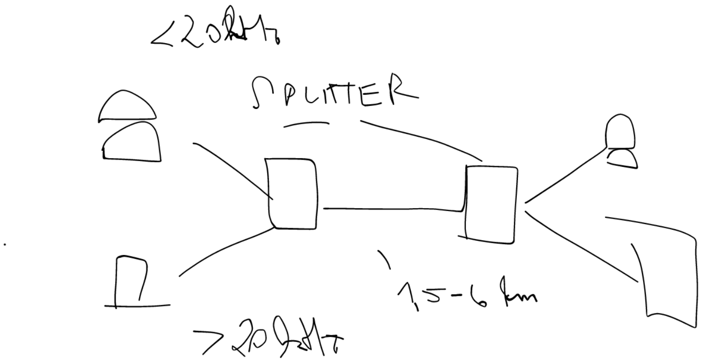

# Otázka 23

Přehled technologií WAN - analogové modemy, ISDN, DSL, mobilní Internet

WAN
- Wide Area Network
- např. internet; propojení LAN mezi sebou; obsluha virtuálními kanály
- až stovky km
- X.25
	- @1974
	- rozhraní mezi konc. zař. - DTE (data terminal equipment) a zař, ukonč. datový okruh - DCE (data circuit-terminating equipment)
	- rozhraní uživatelské sítě (UNI - user-to-network interface)
	- fyzická a linková vrstva OSI
	- koncové zařízení zahájí pomocí `call request`

- Frame Relay
	- podporuje využití optických vláken

- Analogové modemy
	- využití telefoní linky; najednou buď hovor, nebo data
	- 300-3400 Hz
	- max rychlost 56 kb/s

- ISDN
	- telefonní linka
	- digitální přenos
	- lze zároveň hovořit i posílat data ;;; dva kanály po 2 kanály po 64 kb/s + 1 kanál 16 kb/s
- (A)DSL
	- využ. telefonní linku
	- lze telefonovat i posílat data
	- down až 8 Mbit/s
	- up až 640 kb/s

