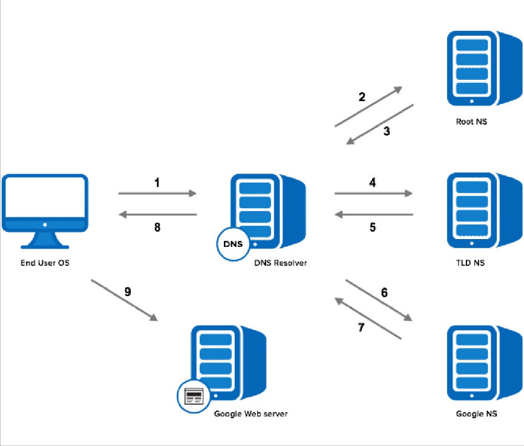

# Otázka 12

# Doménová jména (protokol DNS) a elektronická pošta (protokoly SMTP, IMAP, POP).

## Domény

**DNS**
- UDP/68
- slouží pro překlad doménových jmen na IP adresy

- př.: **www.sssi.cz**
	- **cz** = TLD = doména nejvyššího řádo
		- národní
		- otevřené
	- sssi   = název domény
	- www    = podsíť (teor.)
	- ...  -> další podsítě

proces překladu domény na server v internetu:
1. cz.wikipedia.org
1. comp   cache 			| → router
1. router cache			| → isp dns resolver
1. isp dns resolver cache	| → Root ns
1. root NS cache		| +’*.org ns’+
1. *.org NS 			| • wikipedia ns •
1. wikipedia ns 			| // ♦ cz.* ♦

- získá-li se ip s cache -> **non-autoritativní**
	- lehce pomalejší
	- bezpečnější
- získá-li se ip přímo od zdroje -> **autoritativní**
	- lehce rychlejší
	- méně bezpečný a spolehlivý (DNS poisoning, stará IP adresa, ...)

## Elektronická pošta
- přenos elektronické pošty pomocí internetu

- SMTP
	- TCP/25
	- přenos elektronické pošty

- IMAP
	- TCP/143
	- získávání zpráv ze serveru
	- uživatel spravuje obsah e-mailu na serveru, pouze stahuje hlavičku

- POP3
	- TCP/110
	- získávání zpráv ze serveru
	- stahuje celý email na stranu klienta, načež je na serveru smazán

- klienty: Mozilla Thunderbird, Microsoft Outlook, Mailbird, Windows Mail, ...

