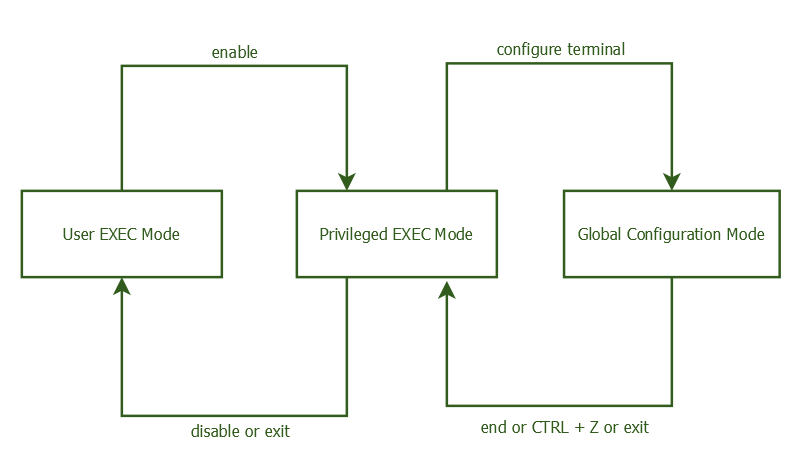

# Otázka 13

## Směrovače Cisco

### základní nastavení
`copy startup-config running-config`

`copy running-config startup-config`

`reload`

### režimy práce

- User EXEC
	- Device>
- Privileged EXEC
	- Device#
- Global Config
	- Device­(co­nfig)#
- Interface Config
	- Device­(co­nfi­g-if)#
- Line Config
	- Device­(co­nfi­g-line)

nastavení jména a hesel
- `hostname <název>`
	- nastaví název zařízení
- `enable secret <název>`
	- nastavení hesla pro `<název>`
- `service passwo­rd-­encrypt`
	- zapne šifrování  hesel

konfigurace
- globální
	- `ip address <adresa>`
	- `no shutdown`
	- `int <rozhraní>`
	- `banner motd #<text>#`
- line
	- `password <název>`
	- `login`

- `show ip route`
- `show interface <rozhraní>`

`ip route <dest> <mask> <interface>`

---
# Externí zdroje

- https://www.netwrix.com/cisco_commands_cheat_sheet.html