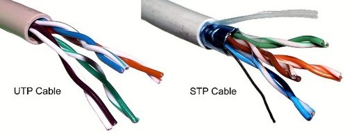
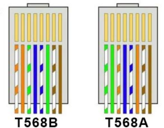

# Otázka 2

## Teorie vedení, metalické kabely v počítačových sítích (koaxiální kabel, UTP, STP).
---

Signál
* digitální = diskrétní v čase
* analogový = spojitý v čase

Strukturovaná kabeláž
* metalická
	* koaxiální (zastaralé)
		* př.: RG58
	* kroucená dvojlinka
		* dané TIA/EIA 568
		* RJ-45
		* CAT5 = 100Mb/S
		* CAT5E = 1Gb/s
* optická

Kroucená dvojlinka dle provedení
* STP = shielded twisted pair
* UTP = unshielded twisted pair

Spojování metalických kabelů je buď přímé nebo křížené

Pozorované veličiny
* útlum
* přeslech (NEXT/FEXT)
* Mapa vodičů
* Délka segmentu

# Další
- http://vavreckova.zam.slu.cz/obsahy/site/site01c_zarizeni.pdf