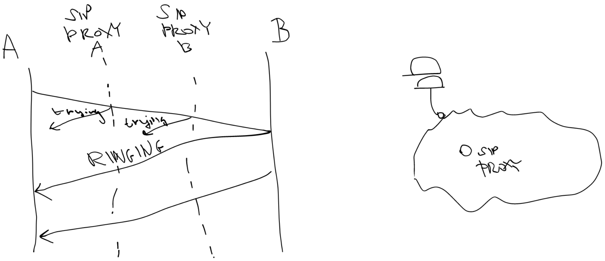

# Otázka 22

VoIP telefonie, protokoly SIP a RTP

## VoIP
- Voice over Internet Protocol
- přesnos přes RTP (real-time transport protocol) @UDP
- signalizace přes H323 nebo SIP (session initiation protocol)

## SIP
- poskytuje
	- lokalizace uživatele – určení koncového systému pro danou komunikaci,
	- navázání spojení – stanovení parametrů pro volající a i volanou stranu,
	- dostupnost uživatele – zjištění (volitelné) dostupnosti volané strany a sledování přítomnosti,
	- uživatelské možnosti – určení média a jeho parametrů.

- neposkytuje:
    - neprovádí management interaktivních relací po jejich navázání,
    - neumí zajistit požadovanou kvalitu služby (QoS), protože neumí upřednostňovat nějaký provoz ani rezervovat potřebné síťové prostředky, ale může spolupracovat s protokoly, které se o zajištění QoS mohou postarat (např. RSVP),
    - není protokol určený k přenosu velkého objemu dat, jako je třeba HTTP, místo toho přenáší pouze malý objem dat potřebných pro navázání interaktivních relací, kromě toho je ještě schopen přenášet krátké textové zprávy.

RTP
- Lehká kategorie: specifikace a implementace
- Přizpůsobivý: představuje mechanizmus, nediktuje 
- algoritmus
- Protokolově neutrální: UDP/IP, ST)II, IPX, ATM)AAL, 
- Měřitelný (scalable): unicast, skupinový od 2 do cc
- Oddělené řízení a data: některé funkce mohou být 
- realizovány protokolem pro řízení konference
- Bezpečný: podpora šifrování, možné ověřování

- funkce
	- Fragmentace a defragmentace pomocí UDP (nebo 
	- podobný protokol)
	- Znovu uspořádání (pokud je to třeba)
	- Detekce ztrát (pro odhad kvality), obnova
	- Synchronizace uvnitř média
	- odstranění „chvění“ zpoždění prostřednictvím 
	- přehrávací vyr. paměti
	- vyrovnání vzorkovacích hodin
	- synchronizace mezi audiem a videem
	- QoS zpětná vazba a adaptace rychlosti
	- Identifikace zdroje

