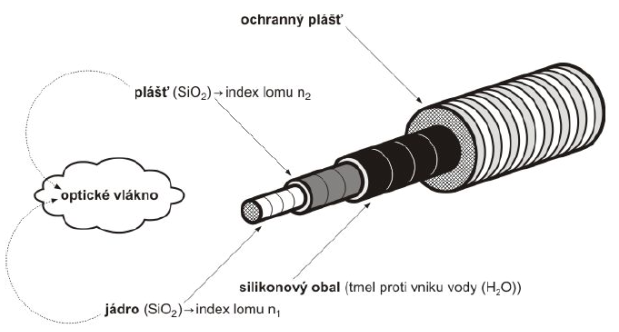
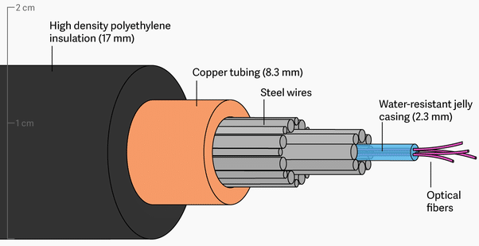

# Otázka 3

## Optické kabely, jejich využití v počítačových sítích.
---

Strukturovaná kabeláž
* metalická
* optická
	* signál přenášen v podobě světelných paprsků prostupujících skleněným/plastovým/hybridním médiem
	* výhody
		* vysoká rychlost
		* veliký dosah <-> nízký útlum
		* malá energetická spotřeba
	* nevýhody
		* vysoká cena
	* minimálně 2 vrstvy <-> Snellůz zákon
	* spojování opt. vláken
		* Konektorem
		* Tavením
		* Mechanickým spojením
	* dle počtu vidů
		* jednovidový
		* mnohavidový
	* dle změny indexu lomu
		* skokový (teoretický; nepoužívaný)
		* gradientní - index lomu se mění postupně

Složení optického vlákna
* ochranný obal
* optické vlákno
* výplňový materiál
* dělící vrstva
* svazek vláken
* plastová výztuha

Používané vlnové délky
* 850 nm
* 1310 nm
* 1550 nm

Dle ochrany
* těsné
* volné

Využití - páteřní kabeláž areálu, přenos na veliké vzdálenosti, ...
