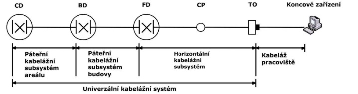

# Otázka 4

## Návrh kabeláže v budově, normy pro strukturovanou kabeláž
---

**Normy**
* EN ČSN 50173
* TIA/EIA
* ISO/IEC  11801

**Součásti strukturované kabeláže**
* horizontální rozvody – rozvody pro příslušné patro,
	* patch  panel  s propojovacími  kabely,  zářezový  blok  s ranžírovacími  dráty, 
	* zásuvka na pracovišti, 
	* horizontální kabel, 
	* nepovinný spoj 
* páteřní rozvody (vertikální) – rozvody propojující jednotlivá podlaží,
	* zřetězené propojení – propojení od síťové místnosti k další 
	* hvězdicové propojení – propojení je realizováno od centrálního uzlu ke všem ostatním
* síťová místnost – tvoří předěl mezi páteřními a horizontálními rozvody 

**Fyzické části**
* rozvodný uzel areálu (CD)
* páteřní kabel areálu
	* max 3km optickým kabelem
* rozvodný uzel budovy (BD)
* páteřní kabel budovy
	* max 500m
* rozvodný uzel podlaží (FD) – datový rozvaděč
* horizontální kabel – datový kabel
	* max 90m
* konsolidační bod (CP)
* kabel konsolidačního bodu (CP kabel)
* sestava TO pro více uživatelů
* telekomunikační vývod (TO) – datová zásuvka

Vlastní zavedení optiky v rámci budovy se provádí více způsoby, a to: 
- plastovým  potrubím  –  metoda  zafukování  optických  vláken  do mikrotrubiček, 
- ohebným plastovým potrubím tzv. husím krkem, 
- kabelovými rošty
- kabelovými závěsy

# Další
- https://www.varnet.cz/soubory-ve-skladu/Karty/Spol_Zarazene/01-MANU%C3%81LY%20CS/SKS%20prirucka%20-%20man-a4.pdf