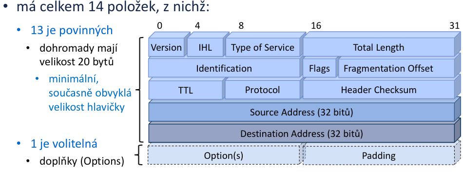

# Otázka 8

## IPv4, IPv6

IP adresy jsou unikátní identifikátory síťového rozhraní, které se používají ke směrování a adresování.

IPv4
	- původní
	- 32 bitů psaných dekadicky po oktetech, oddělených tečkou

IPv6
	- vznik kvůli nedostatečném počtu adres v IPv4
	- 128 bitů psaných hexadecimálně po 16 bitech, oddělených dvojtečkou

## formát hlavičky

**IPv4**

**fragmentace**
-  proces, při kterém je datagram rozdělen na více, jelikož je vetší, než je daná síť schopná zpracovat
- minimální délka je 20 bajtů
- maximální délka je **65635 bajtů !!!**

- Version
	- 4 bity
	- 4/6
- IHL (Internet Header Length)
	- 4 bity
	- velikost hlavíčky * 32 [bit]
- Type of Service
	- „zapomenutý byte“
	- jeho původní význam dnes již není znám
- Total Length
	- 16 bitů
	- celková velikost datagramu * 8 (tedy v bitech), včetně hlavičky
- Identification
	- (16 bitů)
	- všechny fragmenty mají zde stejnou hodnotu jako původní datagram, tím se pozná, že „patří k sobě“
- Flags
	- 3 bity
	- první bit
		- 0, lol
	- druhý bit
		- Don’t Fragment = požadavek o nefragmentování
	- třetí bit
		- More Fragments = příznak identifikující, zda je fragment poslední (1 = nejde o poslední)
- Fragmentation Offset
	- 13 bitů
	-  udává posun začátku datové části fragmentu oproti datové části původního datagramu
	-  v násobcích 8 bytů (64 bitů), proto musí být velikost fragmentů zaokrouhlena na celistvé násobky 8 bytů
- TTL (Time to Live)
	- 8 bitů
	- původně časový udaj, dnes počet zbývajících skoků
- Protocol
	- 8 bitů
	- používaný protokol, např.:
		- 1=ICMP
		- 6=TCP
		- 17=UDP
- Header Checksum
	- 16 bitů
	- kontrolní součet hlavičky

**IPv6**
TODO

## třídy IP adres

Třídy IP adres jsou dané prvním oktetem IPv4 adresy

- A: 0-127.x.x.x
	- velký počet hostů
- B: 128-191.x.x.x
	- střední síť
- C: 192-223.x.x.x
	- LAN
- D: 224.239.x.x.x
	- rezervování pro multi-tasking
- E: 240-254.x.x.x
	- experimentální; výzkum a vývoj

## funkce síťové masky

- rozděluje IP adresu na net_id a host_id
	- net_id - všechny počítače jsou v stejné síti, mají-li tuto čast IP adresy společnou
	- host_id - unikátní identifikátor počítače v síti
- dovoluje rozdělování na podsítě

## přidělení IP adres v síti

z daného rozsahu, který je k dispozici, nelze přidělit první a poslední ip adresu, jelikož první referuje na celou síť a nejvyšší je multicast

## veřejné a neveřejné adresy
Adresy se rozdělují na veřejné a neveřejné. Rozdíl je takový, že veřejné dosáhnout z internetu, kdežto počítače s neveřejnou adresou nelze vyhledat pomocí internetu.

**neveřejné rozsahy adres IPv4**
* 10.x.x.x
* 172.16-31.x.x
* 192.168.x.x
* 100.64-127.x.x/10
	* speciální rozsah doporučený rfc6598 jako využití pro pool adres CGN (Carrier-Grade NAT)
